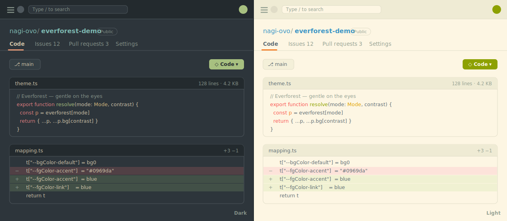

# Everforest for GitHub

<p align="center">
  
</p>

A two-piece Everforest suite for your browser:

1. **A Chrome/Edge extension** that restyles **github.com** with the warm,
   low-contrast [Everforest](https://github.com/sainnhe/everforest) palette —
   code, diffs, issues, pull requests, settings and the rest of the UI, all
   themed coherently (not just the page background), in light & dark with
   soft / medium / hard contrast.
2. **Matching browser themes** that recolor the **Chrome UI itself** — tabs,
   toolbar, address bar, new-tab — from the same palette, so your *whole
   window* is Everforest, not just the page.

Both are generated from one source palette and stay in lockstep. Install the
extension, the browser theme, or both.

> 🖥️ **Try it live:** open [`demo/index.html`](demo/index.html) for an interactive
> light / dark / contrast preview (mock UI — no real GitHub data).

## Features

- 🌲 **Full Everforest palette** — backgrounds, foregrounds, borders, syntax
  highlighting, diffs, the contribution graph, and ANSI logs.
- 🌗 **Light, Dark, or Sync** — "Sync" follows your existing GitHub appearance
  automatically (zero config); Light/Dark force a variant regardless.
- 🎚️ **Soft / Medium / Hard contrast** — Everforest's signature background levels.
- ⚡ **Zero flash** — the theme is injected as CSS at `document_start`, so pages
  paint in Everforest from the first frame. No FOUC, no JavaScript required for
  the base theme.
- 🎯 **Token-level, not brute force** — overrides GitHub's Primer design tokens
  (`--bgColor-*`, `--fgColor-*`, `--borderColor-*`, `--color-prettylights-*`, …),
  so the theme cascades cleanly through GitHub's own component system.
- 🪟 **Companion browser themes** — matching Everforest themes for the Chrome UI
  itself (tabs, toolbar, new-tab), generated from the same palette. See
  [Match the whole browser](#match-the-whole-browser-optional).

## Install (unpacked)

This extension isn't on the Web Store yet — load it unpacked:

```bash
bun install
bun run build      # produces dist/
```

1. Open `chrome://extensions` (or `edge://extensions`).
2. Enable **Developer mode** (top-right).
3. Click **Load unpacked** and select the **`dist/`** folder.
4. Open any GitHub page — it's now Everforest. Click the toolbar icon to choose
   appearance and contrast.

To update after pulling changes: `bun run build`, then hit **Reload** on the
extension card.

## Match the whole browser (optional)

`bun run build` also emits two standalone **Chrome browser themes** that recolor
the browser UI (tabs, toolbar, address bar, new-tab page) to match — so the
chrome around the page is Everforest too, not just GitHub.

> A Chrome theme can't be combined with a content-script extension in one
> package, and only one theme can be active at a time — so these are separate,
> and you pick light **or** dark.

Load one the same way — **Load unpacked** in `chrome://extensions`:

- Dark:  `chrome-themes/everforest-dark`
- Light: `chrome-themes/everforest-light`

> **Heads-up:** a browser theme applies *immediately* but does **not** appear as
> a card on the `chrome://extensions` page — only the GitHub extension does, because
> a theme isn't an "extension". Manage or remove it under **Settings → Appearance**
> (`chrome://settings/appearance`) → **Reset to default**. Only one theme can be
> active at a time; loading the other variant replaces it.

Both are generated from the same `palette.ts`, so the browser UI and the
github.com restyle stay in lockstep.

## Usage

Click the toolbar icon for the popup:

| Control | Options | Default |
| --- | --- | --- |
| **Master switch** | on / off | on |
| **Appearance** | Sync · Light · Dark | Sync |
| **Contrast** | Soft · Medium · Hard | Medium |

"Sync" mirrors GitHub's own light/dark/auto setting, so if you already use
GitHub's automatic day/night switching, Everforest follows it. Settings are
stored in `chrome.storage.sync` and applied live — no reload needed.

## How it works

GitHub renders virtually all of its color through CSS custom properties (the
[Primer](https://primer.style) design tokens). The extension ships a single
generated `theme.css` that re-defines those tokens with Everforest values,
scoped to mirror GitHub's own `data-color-mode` resolution:

```
html:not([data-ef="off"]) … [data-color-mode="light"] { --bgColor-default: #fdf6e3 !important; … }
```

A tiny content script (`content.js`) just reflects your saved settings onto
`<html>` as `data-ef-*` attributes; it does no styling itself. Because the base
theme is plain CSS injected by the manifest, it applies before first paint.

## Development

```bash
bun install
bun run build        # generate dist/ (theme.css + bundled scripts + assets)
bun run watch        # rebuild on change
bun run typecheck    # tsc --noEmit
```

Project layout:

```
src/
  palette.ts    Everforest colors (dark/light × soft/medium/hard) — source of truth
  mapping.ts    GitHub Primer token → Everforest color mapping (the design)
  build.ts      generates dist/theme.css + bundles scripts + copies assets
  settings.ts   shared settings contract (storage)
  content.ts    applies settings as <html> data-ef-* attributes
popup/          settings UI (themed with Everforest itself)
icons/          generated PNG icons (icons/make_icons.py)
scripts/        dev-only helpers (local server, single-mode CSS dump)
```

The palette and token mapping are pure data + a small generator, so tweaking a
color is a one-line edit in `palette.ts` or `mapping.ts` followed by a rebuild.

## Acknowledgements

This extension is a tribute to **[Everforest](https://github.com/sainnhe/everforest)** —
the comfortable, green-based color scheme by **[Sainnhe Park (@sainnhe)](https://github.com/sainnhe)**,
designed to be gentle on the eyes. Everforest *is* the heart of this project: every
color here comes from its carefully tuned palette, and all the credit for how calm
and readable this theme feels belongs to that work.

If you like what you see, please go **★ star
[sainnhe/everforest](https://github.com/sainnhe/everforest)** and explore the
originals for Vim/Neovim, Alacritty, tmux, GTK and many more. 🌲

Everforest is distributed under the MIT License; its palette is reused here with gratitude.

## Trademarks

This is an independent, open-source theme — **not affiliated with, endorsed by, or
sponsored by GitHub, Inc.** “GitHub” is a trademark of GitHub, Inc., used here only
to describe what the extension themes.

## License

MIT — see [LICENSE](LICENSE).
